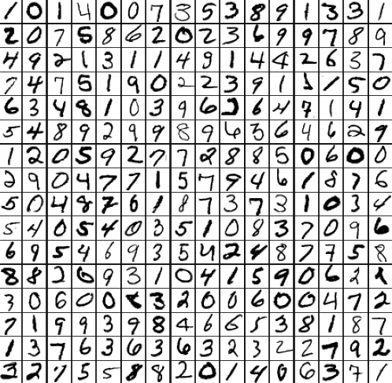
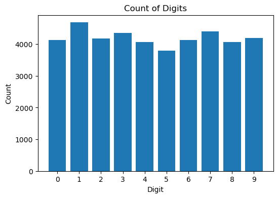
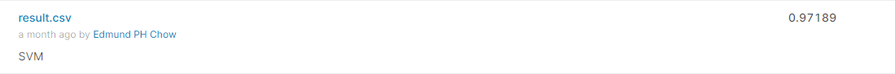
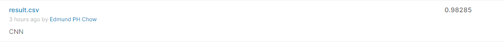

# Digit Recognizer Project


## Project Background
The project is based on the Digit Recognizer compition on Kaggle: https://www.kaggle.com/competitions/digit-recognizer/overview/description 


The Project is about Classification of handwritten digits on the MNIST dataset.\
I will be using the Support Vector Machine and Convolution Neural Network as a classicfication methods. 

## Data Source
The datasets used is The data files train.csv and test.csv from Kaggle which contain gray-scale images of hand-drawn digits, from zero through nine.

There are 875 colomns in the train.csv which consists of a label column showing the digit of the handwritten image, and 874 columns of pixel-values of the 28*28 pixels image.

There are 42000 row of data, the pixel-value range from 0 to 255.

### Preview of first 256 digit from the dataset:
```python 
# Preview of the figures
print("Preview of First 256 digit figures")
traindfpix = traindf.drop(columns = ['label'])
preview = 255-traindfpix
fig, axes = plt.subplots(16, 16, figsize=(9,9),
    subplot_kw={'xticks':[], 'yticks':[]},
    gridspec_kw=dict(hspace=0.01, wspace=0.01))
for i, ax in enumerate(axes.flat):
    if i < 256:
        ax.imshow(preview.iloc[i].array.reshape((28,28)),cmap="gray")
```

### Count of Digits Bar Chart:
```python
# Bar Chart
plt.figure(figsize=(6,4))   
plt.title('Count of Digits')
plt.xlabel('Digit')
plt.ylabel('Count')
plt.bar(range(10),traindf.groupby(["label"]).size(),tick_label=range(10))
```


## Support Vector Machine
The Result of the Classification on Kaggle:

Link to Support Vector Machine Python Notebook: [Digit_Recognizer_SVM](DigitRecognizerSVM.ipynb)

## Convolution Neural Network
The Result of the Classification on Kaggle:

Link to Support Vector Machine Python Notebook: [Digit_Recognizer_CNN](DigitRecognizerCNN.ipynb)
